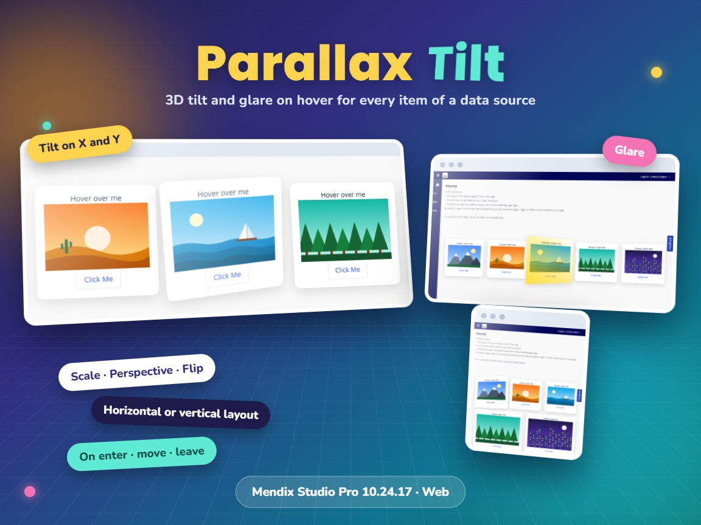
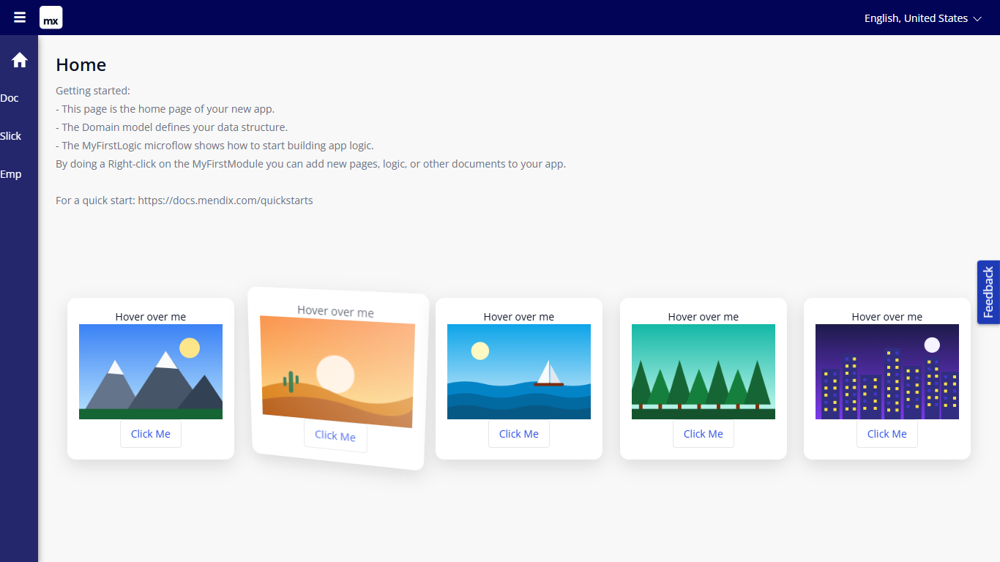
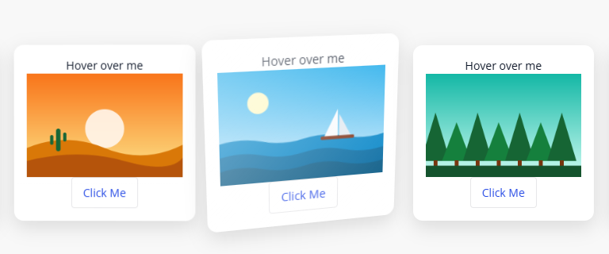
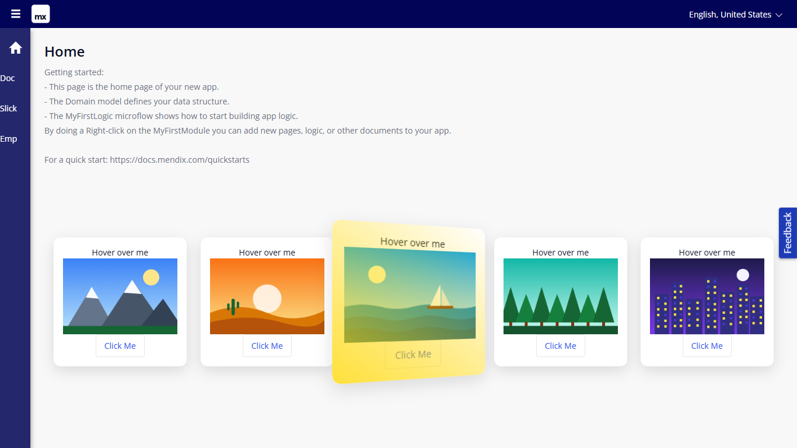
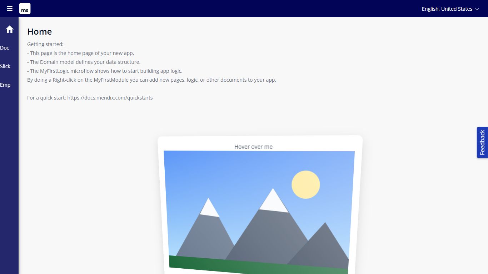
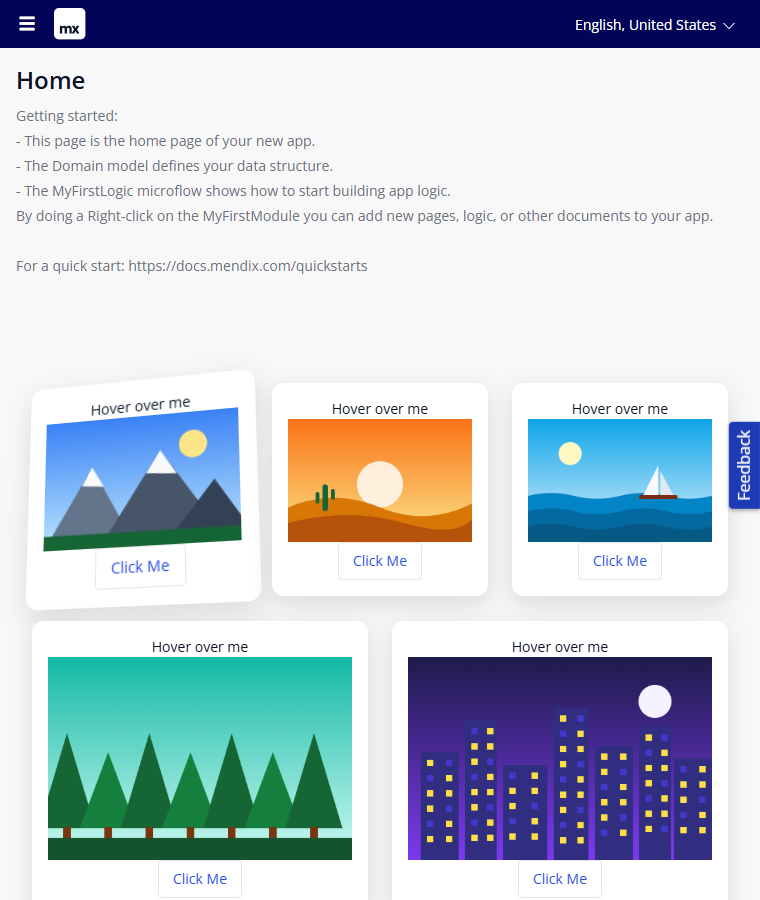
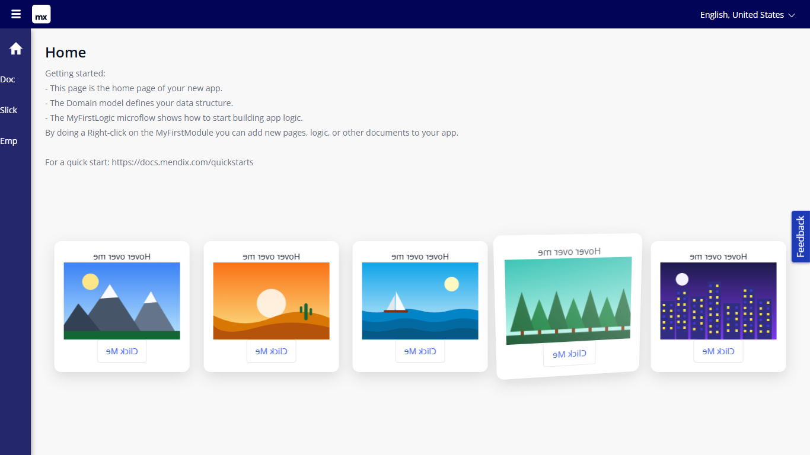

# Parallax Tilt

Easily apply tilt hover effects to elements. Parallax Tilt shows each object of a data source as a card that tilts in 3D towards the mouse, grows a little and shines (glare) while the mouse moves over it.



## Documentation

- [Parallax Tilt 10.24.17.docx](docs/Parallax%20Tilt%2010.24.17.docx): install, upgrade, configuration, properties, examples, styling and limitations.
- [Marketplace documentation](docs/Marketplace%20Documentation%20-%20Parallax%20Tilt.md): the same in short form.

## Version 1.1.0 for Mendix Studio Pro 10.24.17

Parallax Tilt 1.1.0 is rebuilt for **Mendix Studio Pro 10.24.17**.

### Download

- Download `MxTechies.ParallaxTilt.mpk` from the release [Version1.1.0](https://github.com/bharathidas/ParallaxTilt/releases/tag/Version1.1.0) or from the root of this repository.
- Copy it into the `widgets` folder of your app and press **F4** (App > Synchronize App Directory) in Studio Pro.
- The previous package is in release [Version1.0.0](https://github.com/bharathidas/ParallaxTilt/releases/tag/Version1.0.0).

### Changes in 1.1.0

- Built with `@mendix/pluggable-widgets-tools` 10.16.0 for Studio Pro 10.24.17 and React 18, as a production build, with react-parallax-tilt 1.7.345. The package is about 17 KB (1.0.0: about 57 KB).
- Both tilt angles work in both orientations. In 1.0.0 the horizontal orientation used only `tiltMaxAngleX` and the vertical orientation only `tiltMaxAngleY`.
- The glare no longer stays fully visible when a card is not hovered. In 1.0.0 this happened in the vertical orientation (glare position top, bottom or all) and in the horizontal orientation (left, right or all), because the library divided by a tilt angle of 0. An angle of 0 is now handled and the glare works with every position.
- Glare color, glare position and transition easing are optional, with the defaults `#ffffff`, `top` and `cubic-bezier(.03,.98,.52,.99)`. The glare position ignores case and spaces.
- Out-of-range values are limited: angles to 0–90, glare opacity to 0–1; a scale or perspective of 0 or less uses 1 and 1000.
- The CSS classes start with `widget-parallaxtilt` (`widget-parallaxtilt`, `-horizontal`, `-vertical`, `-card`, `-content`). 1.0.0 added global styles for the classes `content` and `slide`, which could change other parts of the app.
- Horizontal cards share the width and wrap to the next line on small screens.
- The class and style set in Studio Pro are applied.
- The On move action does not start again while it is still running.
- Studio Pro design mode shows a card with a drop zone for the content.
- Clearer captions and descriptions. The property keys are the same as in 1.0.0, so existing pages keep their settings.

Tested in a Mendix 10.24.17 app (33 automated checks): both orientations, tilt on X and Y, angle 0, scale, perspective, glare color, position and opacity, tilt and glare off, flip, empty and out-of-range values, and wrapping on a narrow window.

### Upgrading from 1.0.0

1. Replace `MxTechies.ParallaxTilt.mpk` in the `widgets` folder of your app with the 1.1.0 file.
2. Press **F4** (Synchronize App Directory).
3. Studio Pro reports that the widget definition has changed. Right-click the error and choose **Update all widgets**. Your settings are kept.
4. If the running app still shows the old widget, stop it, choose **App > Clean Deployment Directory** and run it again.

Check after upgrading: both angles now apply. For the old one-axis tilt, set Max tilt angle Y to 0 (horizontal) or Max tilt angle X to 0 (vertical). If your theme styled `tilt-container`, `content` or `slide`, use the new classes.

### Source code and build

The widget source is in the [`parallaxTilt`](parallaxTilt) folder.

```
cd parallaxTilt
npm install
npm run release
```

The package is created in `parallaxTilt/dist/1.1.0/MxTechies.ParallaxTilt.mpk`. Node.js 16 or later is required.

---

## Features

### •	Orientation:
Horizontal (a row of cards that wraps) or vertical (a column).
### •	Data source and content:
One card per object; any Mendix widgets as card content.
### •	Tilt enabled:
Enables/disables the tilt effect.
### •	Max tilt angle X:
Maximum tilt rotation (in degrees) on the x-axis. Range: 0°-90°.
### •	Max tilt angle Y:
Maximum tilt rotation (in degrees) on the y-axis. Range: 0°-90°.
### •	Glare enabled:
Enables/disables the glare effect.
### •	Glare max opacity:
Maximum glare opacity (0.5 = 50%, 1 = 100%). Range: 0-1
### •	Glare color:
Sets the color of the glare effect (any CSS color).
### •	Glare position:
Sets the position of the glare effect: top, right, bottom, left or all.
### •	Scale:
Scale of the component (1.5 = 150%, 2 = 200%).
### •	Perspective:
Defines how far the tilt component appears from the user. Lower values create more extreme tilt effects.
### •	Transition easing:
Easing function for the transition.
### •	Transition speed:
Speed of the transition, in milliseconds.
### •	Flip vertically:
Enables/disables vertical flipping of the component.
### •	Flip horizontally:
Enables/disables horizontal flipping of the component.
### •	Events:
On enter, on move and on leave actions.

## Dependencies:
•	Mendix Studio Pro 10.24.17 (widget 1.1.0). Widget 1.0.0: Mendix modeler 10.18.3.

## Issues, suggestions and feature requests
https://github.com/bharathidas/ParallaxTilt/issues

## Screenshots (version 1.1.0, Mendix 10.24.17)

| | |
| --- | --- |
|  |  |
|  |  |
|  |  |

## Screenshots (version 1.0.0)


